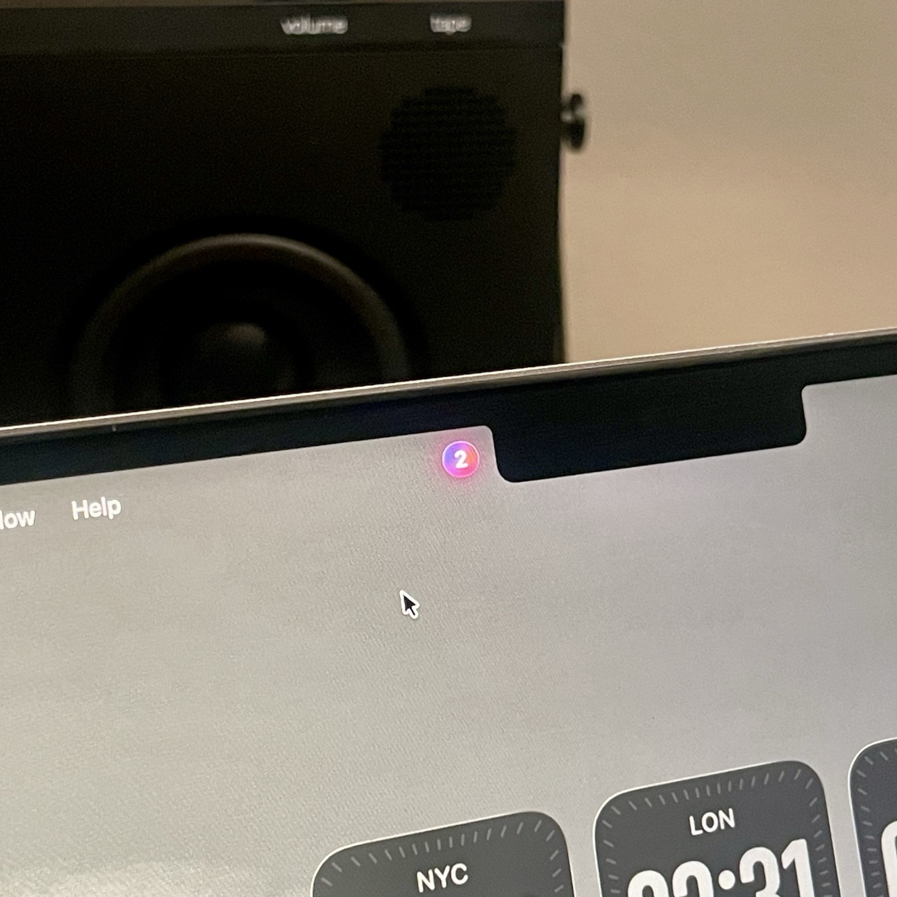
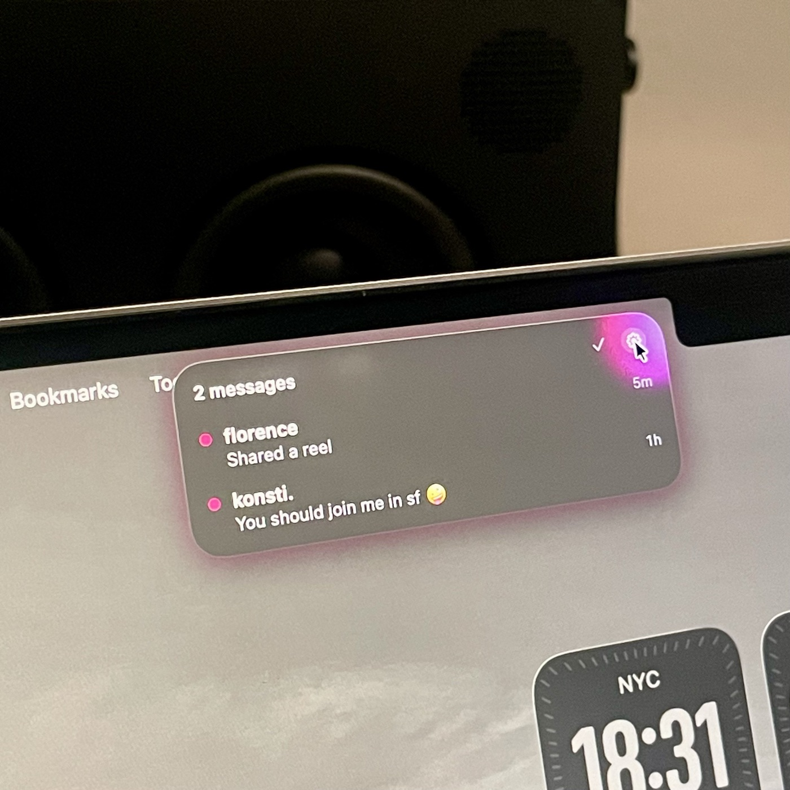

<div align="center">

<picture>
  <source media="(prefers-color-scheme: dark)" srcset="Assets/glint_black.png">
  <source media="(prefers-color-scheme: light)" srcset="Assets/glint_white.png">
  
</picture>

**a quieter way to keep up.**

### [⬇︎ Download Glint for Mac](https://github.com/Grey31415/Glint/releases/latest/download/Glint.dmg)

<sub>Free · macOS 14 or newer · Apple silicon and Intel</sub>

</div>

<p align="center">
  
  &nbsp;
  
</p>

## What is it?

A little dot next to the notch on your Mac. It lights up when someone messages
you on Instagram. Point at it and you can see who wrote and what they said -
without opening Instagram and losing twenty minutes.

Made for people who deleted the app but still want to hear from their friends.

## What the colours mean

| | |
| --- | --- |
| 🟣 **Colourful** | Someone actually wrote to you |
| ⚪️ **Grey** | Just likes or reactions - nothing that needs you |
| **Nothing there** | You're all caught up |

Instagram treats a heart on something you posted the same as a friend asking you
a question. Glint keeps them apart, so the number always means something.

You can also switch on likes, comments, new followers, tags and message
requests - each one separately, and all off to begin with.

## Installing

1. [**Download Glint**](https://github.com/Grey31415/Glint/releases/latest/download/Glint.dmg), open the file and drag Glint into your Applications folder.

2. Open Glint. macOS will say it *"could not verify that this app is free of
   malware"* - click **Done**. This is expected: Glint isn't registered with
   Apple's paid developer programme, so macOS doesn't recognise it.

3. Open **System Settings → Privacy & Security**, scroll down to **Security**.
   You'll see *"Glint was blocked to protect your Mac"* with an **Open Anyway**
   button. Click it and confirm with Touch ID or your password.

4. Open Glint again and click **Open**.

That's a one-time thing. After that it just launches.

<details>
<summary>Prefer one Terminal command instead of steps 2-4?</summary>

```sh
find /Applications/Glint.app -exec xattr -d com.apple.quarantine {} \; 2>/dev/null
```

This removes the "downloaded from the internet" mark, after which Glint opens
normally.

</details>

Then sign in to Instagram once, close the window, and you're done.

## Using it

| | |
| --- | --- |
| **Point at the dot** | See who messaged you |
| **Click the pen** | Reply without opening Instagram |
| **Click a name** | Opens that conversation |
| **Click the dot** | Opens your inbox |
| **⌥ Option-click** | Marks everything as read |
| **Right-click** | Settings and quit |

You can write back from the dot. Point at it, click the pen next to
whoever messaged you, type, and press return. Only conversations have a
pen. Likes, comments and new followers do not, because there is nothing
there to reply to.

Anything you've already read disappears from the list, so it only ever shows
what's actually waiting for you.

**Want it even quieter?** Turn on *Hidden mode* in Settings and the dot vanishes
inside the notch completely. Move your cursor there and it slides back out.

## Is this safe?

Short answer: yes, and you don't have to take my word for it.

- **Glint never sees your password.** You type it into Instagram's own login
  page, exactly like you would in Safari.
- **Nothing leaves your Mac.** Your login is stored by macOS in the same place it
  keeps Safari's. Glint has no website, no account and no server to send
  anything to.
- **It only talks to Instagram.** It asks Instagram the same questions the
  website asks itself, and reads the answer. No tracking, no analytics.
- **It only sends what you type.** Replies go out when you press return, and
  never otherwise. Glint writes nothing to your account on its own.
- **You can undo it any time.** Settings → *Sign out* wipes the saved login off
  your Mac.

The app explains all of this when you first open it, before it asks you for
anything.

## Could this get my account banned?

Unlikely, but not impossible, and you should know why before you install it.

Instagram's terms ask you to use your account through their own apps and
nothing else. Glint is something else, so it goes against those terms, the same
as every other third-party Instagram client. No amount of good behaviour on
Glint's part changes that, and it is the honest reason to think twice.

What keeps the risk small is how Glint works. It is a real signed-in Instagram
page in the same web engine Safari uses, asking for your inbox the way that
page asks for it, about as often as an open tab would, and not at all while
your Mac is asleep or locked. It never acts on its own either: replies go out
when you press return, one at a time, to people already talking to you.
Nothing is posted, followed, liked or messaged automatically, and automated
behaviour in bulk is what account bans are aimed at.

If Instagram does object, what you will almost certainly meet first is a
request to log in again, which the app handles. Anything worse than that is
rare. Even so, it is your account, so if losing it would be a serious problem,
saying no to this is a perfectly reasonable thing to do.

## Something not working?

Open Settings - it shows what Glint is doing and usually says what's wrong. If
Instagram signed you out, there's a button to sign back in.

---

<div align="center">

Made in Germany by **Greyson Wiesenack** &nbsp;·&nbsp; [MIT licensed](LICENSE)

<sub>Curious how it works under the hood? → <a href="README_for_nerds.md">README for nerds</a></sub>

</div>
